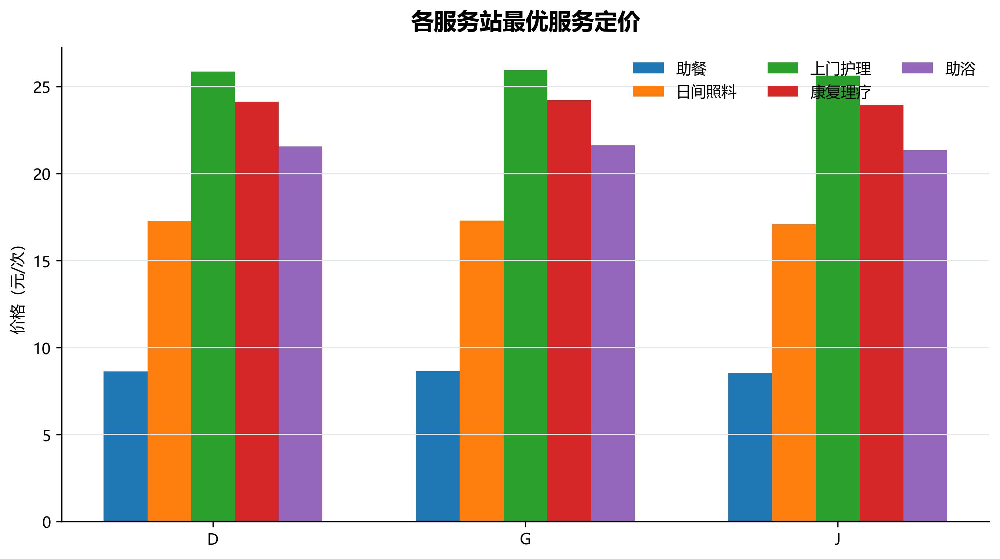
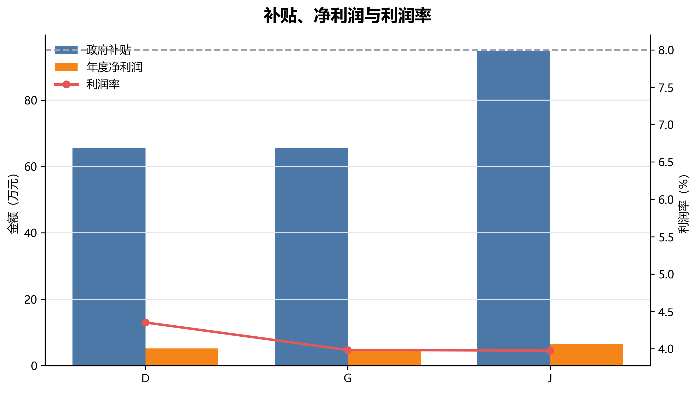
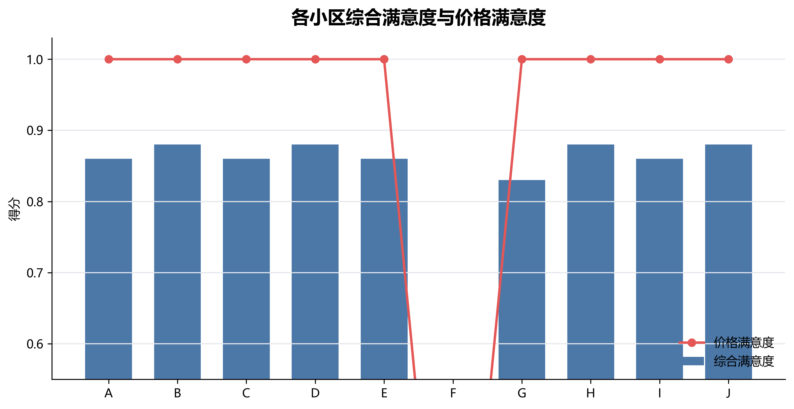
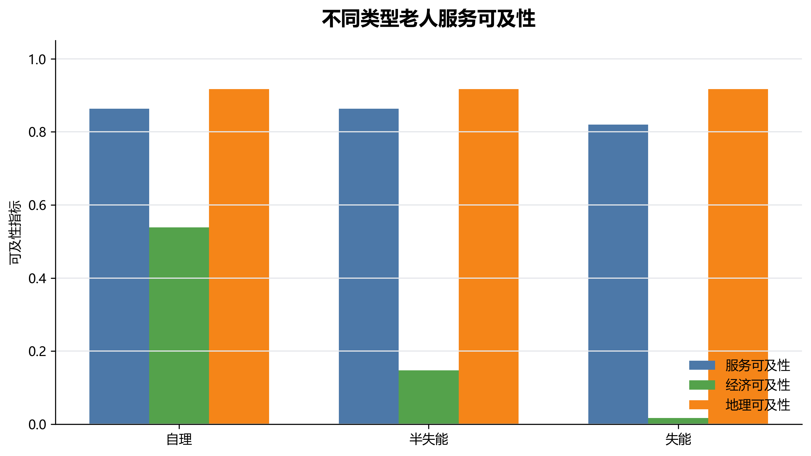

# 第三问：服务定价与政府补贴优化

## 1 问题重述与建模思路

第三问固定第二问得到的最优站点方案，即 \(D\) 小区中型站、\(G\) 小区中型站、\(J\) 小区大型站，并保持第二问的覆盖关系不变。在此基础上，允许各服务站对助餐、日间照料、上门护理、康复理疗、助浴五类非紧急服务自主定价，紧急救助保持公益免费。政府对非紧急服务按实际有效服务人次补贴 2 元/人次，并设置单站每日补贴上限。优化目标是在满足机构“保本微利、利润率不超过 8%”的前提下，最大化老人满意度。

本文沿用 `docs/问题分析.md` 中建议的“候选价格档位枚举 + 约束过滤”方法。由于站点和覆盖关系已经固定，各服务站之间不存在容量共享或价格联动约束，因此可对每个站点独立枚举价格向量，再汇总得到全局方案。考虑到第二问的站点已接近满负荷，第三问不再将价格变化后的容量作为硬筛选条件，而是通过利用率对应的响应满意度 \(S_2\) 反映高负荷对服务体验的影响。

## 2 模型建立

### 2.1 决策变量

给定问题二最优站点集合 \(J^\star=\{D,G,J\}\)，对每个站点 \(j\in J^\star\) 和每个服务 \(s\in S\)，设服务价格为
\[
p_{j,s}\ge 0.
\]
紧急救助为公益免费，因此
\[
p_{j,e}=0,\quad j\in J^\star.
\]

### 2.2 价格满意度与需求调整

附件5给出的价格满意度规则为
\[
S_{3,j,s}=
\begin{cases}
1.00,&p_{j,s}\le p_s^0,\\
0.90,&p_s^0<p_{j,s}\le1.1p_s^0,\\
0.75,&1.1p_s^0<p_{j,s}\le1.2p_s^0,\\
0.60,&p_{j,s}>1.2p_s^0.
\end{cases}
\]
在站点 \(j\) 的价格下，小区 \(i\)、老人类型 \(t\) 的理论月费用为
\[
E_{i,t,j}(p)=\sum_{s\in S}p_{j,s}q_{s,t}^0.
\]
消费上限为
\[
L_{i,t}=\alpha_tM_i.
\]
价格对应的需求削减系数为
\[
\lambda_{i,t,j}(p)=\min\left\{1,\frac{L_{i,t}}{E_{i,t,j}(p)}\right\}.
\]
于是价格约束后的月需求为
\[
Q_{i,s,t,5}(p)=N_{i,5}^t\operatorname{round}\left(\lambda_{i,t,j}(p)q_{s,t}^0\right),
\quad u_{i,j}=1.
\]

小区 \(i\) 的需求加权价格满意度为
\[
\overline S_{3,i,j}=
\frac{\sum_{s,t}Q_{i,s,t,5}(p)S_{3,j,s}}
{\sum_{s,t}Q_{i,s,t,5}(p)}.
\]
综合满意度为
\[
S_{ij}(p)=0.2S_{1,ij}+0.3S_{2,j}(p)+0.5\overline S_{3,i,j}.
\]

### 2.3 补贴与利润率约束

实际有效服务人次为
\[
Q_{i,s,t,5}^{\mathrm{eff}}(p)=Q_{i,s,t,5}(p)S_{ij}(p).
\]
非紧急服务补贴为 2 元/人次，并受每日上限约束：
\[
H_j(p)=\min\left\{365b_{k(j)},\,
12\cdot2\sum_{i,t}\sum_{s\ne e}u_{i,j}Q_{i,s,t,5}^{\mathrm{eff}}(p)
\right\}.
\]
其中中型站 \(b_k=1800\)，大型站 \(b_k=2600\)。

服务总利润为
\[
G_j(p)=12\sum_{i,t,s}u_{i,j}Q_{i,s,t,5}^{\mathrm{eff}}(p)(p_{j,s}-c_s).
\]
年运营成本总额为
\[
A_j=365F_{k(j)}+\frac{10000B_{k(j)}}{20}.
\]
利润率定义为
\[
\mathrm{PR}_j(p)=\frac{G_j(p)+H_j(p)-A_j}{A_j}.
\]
保本微利约束写为
\[
0\le\mathrm{PR}_j(p)\le 8\%,\quad j\in J^\star.
\]

### 2.4 优化目标

最大化覆盖老人加权综合满意度：
\[
\max_p\ \overline S(p)=
\frac{\sum_iN_{i,5}\sum_j u_{i,j}S_{ij}(p)}
{\sum_iN_{i,5}\sum_j u_{i,j}}.
\]
当多组价格满意度相同且均满足利润率约束时，本文优先选择加权价格倍率更低、利润率更接近 \(4\%\) 的方案，使老人负担更低且机构仍保留微利空间。

## 3 求解算法

为降低维度并保持站点内部价格体系简洁，本文采用 `docs/问题分析.md` 中的降维策略：每个服务站使用一个整体价格倍率 \(r_j\)，即同一站点内五类非紧急服务按相同倍率调整。候选价格倍率取
\[
r_j\in\{0.300,0.301,\ldots,0.999,1.000\},
\quad p_{j,s}=r_jp_s^0.
\]
对每个站点独立枚举 701 个价格倍率。每个价格倍率按如下步骤评价：

1. 根据价格计算各小区、各老人类型的消费约束需求；
2. 根据价格满意度、距离满意度和响应满意度迭代求得 \(S_{ij}\)；
3. 计算实际有效服务人次、政府补贴、服务总利润和利润率；
4. 剔除利润率不在 \([0,8\%]\) 内的方案；
5. 在可行价格向量中选择满意度最高的方案。

## 4 求解结果

核心指标如下。

| 指标 | 数值 |
| --- | --- |
| 固定站点数量 | 3 |
| 覆盖老人数量 | 7058 |
| 服务覆盖率 | 0.9313 |
| 覆盖人口加权满意度 | 0.8634 |
| 覆盖人口加权价格满意度 | 1 |
| 政府补贴总额（元） | 2263000 |
| 年度净利润合计（元） | 163455.0930 |

### 4.1 最优定价

| 站点 | 规模 | 助餐价格 | 日间照料价格 | 上门护理价格 | 康复理疗价格 | 助浴价格 | 紧急救助价格 | 加权价格倍率 | 价格满意度 |
| --- | --- | --- | --- | --- | --- | --- | --- | --- | --- |
| D | 中型 | 8.62 | 17.24 | 25.86 | 24.14 | 21.55 | 0 | 0.86 | 1 |
| G | 中型 | 8.65 | 17.30 | 25.95 | 24.22 | 21.62 | 0 | 0.86 | 1 |
| J | 大型 | 8.54 | 17.08 | 25.62 | 23.91 | 21.35 | 0 | 0.85 | 1 |

### 4.2 利润、利润率与补贴

| 站点 | 规模 | 服务总利润_元 | 政府补贴_元 | 年运营成本_元 | 年度净利润_元 | 利润率 | 日有效服务人次 | 响应满意度 |
| --- | --- | --- | --- | --- | --- | --- | --- | --- |
| D | 中型 | 578529.0240 | 657000 | 1184000 | 51529.0240 | 0.0435 | 1995.2980 | 0.6000 |
| G | 中型 | 574168.9896 | 657000 | 1184000 | 47168.9896 | 0.0398 | 1870.0127 | 0.7200 |
| J | 大型 | 744257.0794 | 949000 | 1628500 | 64757.0794 | 0.0398 | 3077.2747 | 0.6000 |
| 合计 |  | 1896955.0930 | 2263000 | 3996500 | 163455.0930 |  | 6942.5853 |  |

### 4.3 小区满意度与价格满意度

| 小区 | 第5年老人总数 | 服务站 | 综合满意度 | 价格满意度 | 响应满意度 | 月有效服务人次 |
| --- | --- | --- | --- | --- | --- | --- |
| A | 786 | J | 0.8600 | 1 | 0.6000 | 23225.1600 |
| B | 671 | J | 0.8800 | 1 | 0.6000 | 20086.8800 |
| C | 1016 | G | 0.8600 | 1 | 0.7200 | 30246.2000 |
| D | 601 | D | 0.8800 | 1 | 0.6000 | 17600 |
| E | 866 | G | 0.8600 | 1 | 0.7200 | 25854.1800 |
| F | 521 | 未覆盖 | 0 | 0 | 0 | 0 |
| G | 954 | J | 0.8300 | 1 | 0.6000 | 27479.6400 |
| H | 627 | D | 0.8800 | 1 | 0.6000 | 18363.8400 |
| I | 813 | D | 0.8600 | 1 | 0.6000 | 23895.1000 |
| J | 724 | J | 0.8800 | 1 | 0.6000 | 21526.5600 |

## 5 不同类型老人服务可及性分析

本文从三方面刻画可及性：经济可及性表示消费上限的剩余空间，地理可及性用距离满意度表示，服务可及性用实际有效服务量与理论需求量之比表示。结果如下。

| 老人类型 | 覆盖人数 | 服务可及性 | 经济可及性 | 地理可及性 |
| --- | --- | --- | --- | --- |
| 自理 | 4636 | 0.8634 | 0.5385 | 0.9168 |
| 半失能 | 1371 | 0.8634 | 0.1474 | 0.9169 |
| 失能 | 1051 | 0.8195 | 0.0167 | 0.9172 |

从结果看，自理老人服务频次低、价格敏感性较弱，经济可及性最高；半失能老人和失能老人护理、康复、助浴等需求较高，消费约束更容易发挥作用。补贴和降价以后，三类老人的价格满意度均保持在 1.00，但失能老人仍因需求基数高、服务消耗大而表现出更低的服务可及性。因此后续政策若进一步倾斜，应优先面向失能和半失能老人，提高护理、康复、助浴服务的专项补贴强度。

## 6 结论

在固定第二问站点和覆盖关系的条件下，本文通过枚举价格档位得到满足利润率约束的最优定价方案。各站点利润率均处于 \(0\%\) 到 \(8\%\) 之间，政府补贴有效降低了服务价格，同时使价格满意度保持满分。最终覆盖人口加权综合满意度为 0.8634，覆盖人口加权价格满意度为 1.0000，政府年度补贴总额为 2263000.00 元。该结果为后续第四问的参数敏感性分析提供了基准定价和补贴方案。
