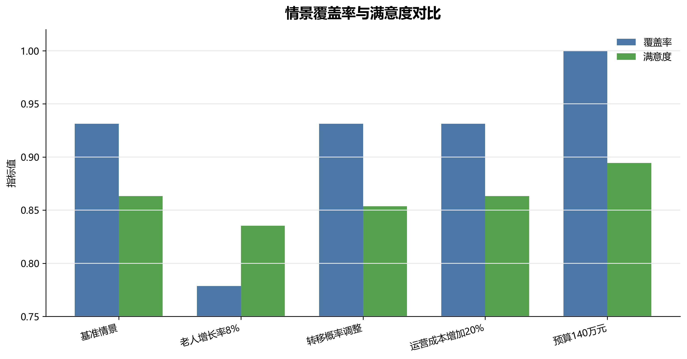
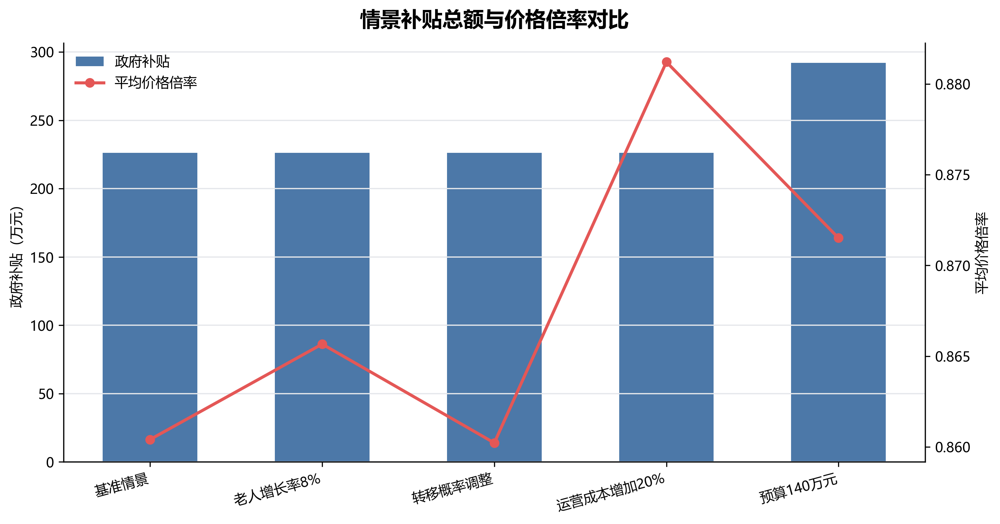
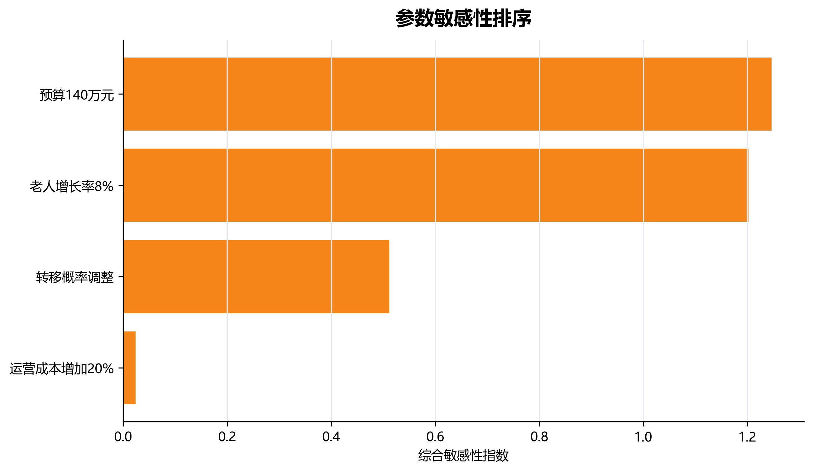
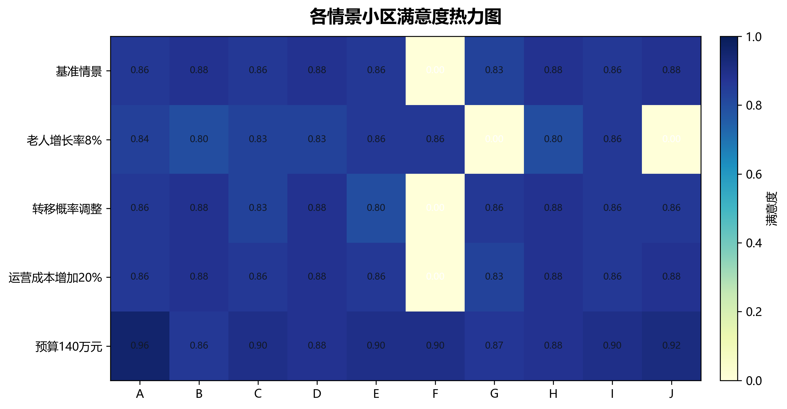

# 第四问：灵敏度分析与方案比较

## 1 问题重述与分析框架

第四问要求分别改变老人增长率、健康状态转移概率、日固定管理成本和建设预算，并重新求解问题2和问题3，比较站点数量、位置、服务定价、政府补贴总额、覆盖率和满意度等指标。本文严格采用 `docs/问题分析.md` 中的“情景重求解 + 指标归一化 + 稳定性排序”路线，对每个情景完整执行：
\[
\text{问题1预测}\rightarrow\text{问题2选址规模优化}\rightarrow\text{问题3定价补贴优化}.
\]

情景参数设置如下。

| 情景 | 参数变化 |
| --- | --- |
| 基准情景 | \(\eta=0.07,\rho_{ah}=0.045,\rho_{hd}=0.10,B^{\max}=120\) 万元 |
| 老人增长率8% | 60+老人净增长率由基准约2%调整为8%；在死亡率 \(\mu=0.05\) 不变时，令新增老人比例 \(\eta=0.13\) |
| 转移概率调整 | \(\rho_{ah}=0.055,\rho_{hd}=0.095\) |
| 运营成本增加20% | 各规模站点日固定管理成本乘以 1.2 |
| 预算140万元 | 总建设预算由 120 万元提高到 140 万元 |

其中老人总量在整数化前满足 \(N_{y+1}=(1-\mu+\eta)N_y\)。因此当题面要求“60+老人年增长率调整为8%”时，应令 \(\eta-\mu=0.08\)，即 \(\eta=0.13\)，而不是简单把新增老人比例改为 0.08。

## 2 比较指标

设基准情景为 \(0\)，其他情景为 \(r\)。站点集合变化定义为
\[
\Delta J_r=1-\frac{|J_r\cap J_0|}{|J_r\cup J_0|}.
\]
覆盖率、满意度、补贴和价格变化率分别为
\[
\delta\mathrm{Cov}_r=\frac{\mathrm{Cov}_r-\mathrm{Cov}_0}{\mathrm{Cov}_0},
\quad
\delta\overline S_r=\frac{\overline S_r-\overline S_0}{\overline S_0},
\]
\[
\delta H_r=\frac{H_r-H_0}{H_0},
\quad
\delta p_r=\frac{\bar p_r-\bar p_0}{\bar p_0}.
\]
本文取等权敏感性指数
\[
\mathrm{SI}_r=
|\delta\mathrm{Cov}_r|+
|\delta\overline S_r|+
|\delta H_r|+
|\delta p_r|+
\Delta J_r.
\]
该指标越大，说明方案对该参数越敏感。

## 3 情景重求解结果

各情景的核心结果如下。

| 情景 | 老人总数 | 站点数量 | 站点方案 | 建设成本_万元 | 覆盖率 | 问题3满意度 | 平均价格倍率 | 政府补贴_元 | 年度净利润_元 |
| --- | --- | --- | --- | --- | --- | --- | --- | --- | --- |
| 基准情景 | 7579 | 3 | D-中型,G-中型,J-大型 | 109 | 0.9313 | 0.8634 | 0.8604 | 2263000 | 159721.9188 |
| 老人增长率8% | 10089 | 3 | E-大型,G-大型,H-小型 | 108 | 0.7787 | 0.8354 | 0.8657 | 2263000 | 160118.7101 |
| 转移概率调整 | 7579 | 3 | D-中型,I-中型,J-大型 | 109 | 0.9313 | 0.8537 | 0.8602 | 2263000 | 159398.9808 |
| 运营成本增加20% | 7579 | 3 | D-中型,G-中型,J-大型 | 109 | 0.9313 | 0.8634 | 0.8812 | 2263000 | 191326.5865 |
| 预算140万元 | 7579 | 4 | A-小型,G-大型,H-中型,J-大型 | 140 | 1 | 0.8945 | 0.8715 | 2920000 | 207435.3652 |

各情景站点层面的方案如下。

| 情景 | 站点 | 规模 | 覆盖小区 | 服务价格倍率 | 政府补贴_元 | 净利润_元 | 利润率 |
| --- | --- | --- | --- | --- | --- | --- | --- |
| 基准情景 | D | 中型 | D、H、I | 0.8612 | 657000 | 47129.6085 | 0.0398 |
| 基准情景 | G | 中型 | C、E | 0.8650 | 657000 | 47168.9896 | 0.0398 |
| 基准情景 | J | 大型 | A、B、G、J | 0.8551 | 949000 | 65423.3207 | 0.0402 |
| 老人增长率8% | E | 大型 | I、H、C | 0.8560 | 949000 | 65186.3213 | 0.0400 |
| 老人增长率8% | G | 大型 | F、D、B、E | 0.8548 | 949000 | 65309.9971 | 0.0401 |
| 老人增长率8% | H | 小型 | A | 0.8862 | 365000 | 29622.3917 | 0.0401 |
| 转移概率调整 | D | 中型 | J、H、D | 0.8631 | 657000 | 47189.7525 | 0.0399 |
| 转移概率调整 | I | 中型 | C、G | 0.8625 | 657000 | 47423.9589 | 0.0401 |
| 转移概率调整 | J | 大型 | E、I、A、B | 0.8550 | 949000 | 64785.2694 | 0.0398 |
| 运营成本增加20% | D | 中型 | D、H、I | 0.8828 | 657000 | 56495.2462 | 0.0399 |
| 运营成本增加20% | G | 中型 | C、E | 0.8870 | 657000 | 56889.9042 | 0.0401 |
| 运营成本增加20% | J | 大型 | A、B、G、J | 0.8739 | 949000 | 77941.4361 | 0.0400 |
| 预算140万元 | A | 小型 | A | 0.8932 | 365000 | 29549.3802 | 0.0400 |
| 预算140万元 | G | 大型 | C、E、F | 0.8648 | 949000 | 65401.2588 | 0.0402 |
| 预算140万元 | H | 中型 | B、D、H | 0.8653 | 657000 | 47538.2116 | 0.0402 |
| 预算140万元 | J | 大型 | G、I、J | 0.8629 | 949000 | 64946.5146 | 0.0399 |

完整服务定价已导出至 `docs/tables/q4_price_comparison.csv`。下表展示各情景各站的加权价格倍率和主要价格信息。

| 情景 | 站点 | 规模 | 助餐价格 | 日间照料价格 | 上门护理价格 | 康复理疗价格 | 助浴价格 | 加权价格倍率 |
| --- | --- | --- | --- | --- | --- | --- | --- | --- |
| 基准情景 | D | 中型 | 8.600 | 17.240 | 25.860 | 24.136 | 21.675 | 0.861 |
| 基准情景 | G | 中型 | 8.650 | 17.300 | 25.950 | 24.220 | 21.625 | 0.865 |
| 基准情景 | J | 大型 | 8.550 | 17.100 | 25.650 | 23.940 | 21.425 | 0.855 |
| 老人增长率8% | E | 大型 | 8.560 | 17.120 | 25.680 | 23.968 | 21.400 | 0.856 |
| 老人增长率8% | G | 大型 | 8.550 | 17.100 | 25.620 | 23.940 | 21.275 | 0.855 |
| 老人增长率8% | H | 小型 | 8.860 | 17.720 | 26.700 | 24.808 | 22.025 | 0.886 |
| 转移概率调整 | D | 中型 | 8.630 | 17.260 | 25.860 | 24.164 | 21.750 | 0.863 |
| 转移概率调整 | I | 中型 | 8.620 | 17.260 | 25.800 | 24.192 | 21.750 | 0.863 |
| 转移概率调整 | J | 大型 | 8.550 | 17.100 | 25.650 | 23.940 | 21.375 | 0.855 |
| 运营成本增加20% | D | 中型 | 8.830 | 17.660 | 26.400 | 24.724 | 22.075 | 0.883 |
| 运营成本增加20% | G | 中型 | 8.870 | 17.740 | 26.610 | 24.836 | 22.200 | 0.887 |
| 运营成本增加20% | J | 大型 | 8.740 | 17.480 | 26.220 | 24.472 | 21.725 | 0.874 |
| 预算140万元 | A | 小型 | 8.930 | 17.860 | 26.790 | 25.004 | 22.475 | 0.893 |
| 预算140万元 | G | 大型 | 8.650 | 17.300 | 25.800 | 24.248 | 21.725 | 0.865 |
| 预算140万元 | H | 中型 | 8.650 | 17.300 | 26.100 | 24.220 | 21.475 | 0.865 |
| 预算140万元 | J | 大型 | 8.630 | 17.260 | 25.890 | 24.164 | 21.450 | 0.863 |

## 4 敏感性排序与鲁棒性评价

相对于基准情景，各参数变化率和综合敏感性指数如下。

| 情景 | 站点集合变化 | 覆盖率变化率 | 满意度变化率 | 补贴变化率 | 价格倍率变化率 | 综合敏感性指数 |
| --- | --- | --- | --- | --- | --- | --- |
| 预算140万元 | 0.8333 | 0.0738 | 0.0360 | 0.2903 | 0.0129 | 1.2464 |
| 老人增长率8% | 1 | -0.1639 | -0.0324 | 0 | 0.0061 | 1.2024 |
| 转移概率调整 | 0.5000 | 0 | -0.0112 | 0 | -0.0002 | 0.5114 |
| 运营成本增加20% | 0 | 0 | 0 | 0 | 0.0242 | 0.0242 |

各小区满意度热力图如下。

从综合敏感性指数看，最敏感的情景为“预算140万元”，最稳定的情景为“运营成本增加20%”。预算提高会直接改变可建设规模并把覆盖率提升至 100%，因此敏感性最高；老人净增长率提高到 8% 后，第5年老人总量明显增加，在 120 万元预算下覆盖率下降并触发站点重构，敏感性仅次于预算调整；转移概率的小幅变化主要影响站点位置和满意度，影响有限。运营成本增加20%主要通过提高价格倍率来维持利润率，并未改变站点集合、覆盖率、满意度和补贴，因此在纳入价格变化后的综合指数中仍表现较稳定。

## 5 实际推广中的其他不确定因素与应对策略

| 不确定因素 | 可能影响 | 应对策略 |
| --- | --- | --- |
| 健康状态转移具有随机波动 | 护理、助浴、康复等需求偏离五年预测 | 建立滚动预测机制，每年更新转移概率并设置需求安全裕度 |
| 服务人员供给不足 | 有站点容量但无法提供足够护理、康复、助浴服务 | 将容量细分为护理员、康复师、餐位、助浴设备等多资源约束 |
| 实际道路通行时间变化 | 距离满意度不能真实反映上门服务响应 | 使用道路网络时间距离替代小区间距离，并对上门服务建路径优化模型 |
| 老人收入与支付意愿变化 | 消费约束和价格满意度发生变化 | 建立分收入层需求模型，设置低收入老人专项补贴 |
| 补贴政策调整 | 利润率、价格倍率和财政支出变化 | 设计多补贴标准情景，并加入财政总支出上限约束 |
| 小区场地可用性差异 | 理论最优站点可能无法实际落地 | 增加场地面积、租金、改造周期和产权可行性约束 |

## 6 结论

本文对四类单因素变化进行了完整重求解。结果表明，当前基准方案在多数情景下仍能保持较高覆盖率和满意度；预算提高能够把覆盖率提升到100%，但也显著增加补贴支出，说明扩建政策需要同步评估长期财政承受能力。运营成本上升时站点布局保持不变，主要通过上调价格倍率消化成本压力。若政策目标是提高覆盖率，增加建设预算更直接有效；若政策目标是控制财政支出，则需要重点监测固定管理成本和补贴封顶标准。建议实际推广时采用滚动预测与年度复核机制，在老人结构、成本和预算发生明显变化时重新运行选址和定价模型。
